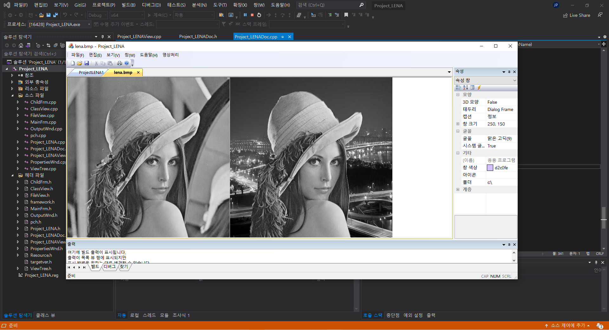

## [팀 프로젝트]

날짜: 2021.06.09

---

### 1. 요구사항 분석 (Requirement Analysis)

- 논리연산을 이용한 영상 합성 프로그램
- BMP 파일 입출력
- 마스크 영상을 이용하여 AND연산과 OR연산을 구현하여 새로운 영상을 생성, 저장
- MFC 프로젝트 이용

 

---

### 2. 구조 설계 (Structure Design)

#### 1) UML(Unified Modeling Language) Diagram

**(1) Use Case Diagram**

 

**(2) Sequence Diagram**

 

**(3) Class Diagram**

 

#### 2) 헤더 생성

- **CView 헤더**
  - 사용자의 화면에 보여주는 역할을 하기 위한 변수와 함수들이 정의되어 있다.
- **CDoc 헤더**
  - 애플리케이션 내부에서 데이터를 읽고 저장하는 기능을 위한 변수와 함수들이 정의되어 있다.

 

#### 3) 클래스 생성

- **CView 클래스**
  - 애플리케이션의 클라이언트 또는 작업 영역을 나타내는 클래스로 document 안에 있는 데이터를 뷰를 통해 화면에 보일 수 있도록 하는 기저 클래스이다.

  - CView 클래스로부터 상속받은 여러 가지 형태의 폼 윈도우들이 있다.

  - 작업 영역으로 들어오는 메시지들을 처리 할 수 있다.

  - 사용자뷰들은 이 CView 클래스로부터 상속받아 사용한다.
   
 

- **CDoc 클래스**
- 함수 기능을 수행하는 클래스이다.
  
- 애플리케이션 내부에서 데이터를 읽고, 저장하는 기능을 가진 클래스로 애플리케이션이 지정한 도큐먼트의 기본 클래스이다.
  
- 입출력을 제공하므로 데이터의 입출력에 관한 내용은 이 클래스를 사용하는 것이 좋다.
  
- 사용자의 도큐먼트들은 이 CDocument 클래스로부터 상속받아 사용한다.

 

#### 4) 기능(함수)

- **Document 클래스 안에 있는 메서드**
  - **OnOpenDocument 메서드**: 입력된 파일 이름으로 파일을 열 때 실행되는 기능을 한다. 
  
  - **OnSaveDocument 메서드**: bmp 형식으로 데이터를 저장하는 기능을 한다. 
  
  - **OnFrameComb 메서드**: for 문을 이용하여 (입력 영상, 마스크 영상) 을 AND연산을 진행하고 (배경 영상, NOT(마스크 영상)) AND 연산을 하여 그 후  OR연산을 하는 기능을 한다.
  - **OnImgComb 메서드**: 입력된 영상, 마스크 영상, 배경 영상을 가지고 OnFrameComb함수를 이용하여 논리연산을 하는 기능을 한다.
  
   
  
- **View 클래스 안에 있는 메서드**
- **OnDraw 메서드**: 애플리케이션의 화면을 통해서 데이터를 보여주는 기능을 한다.
  
- **OnImgComb 메서드**: CProjectLENADoc의 OnlmgComb함수가 기능하도록 호출하는 기능을 한다.

---

### 3. 입력/출력 데이터 정의 (Data Structure Design)

- **데이터 종류**: BMP 영상

- **입력**: BMP 영상 (흑백 또는 컬러)

- **출력**: BMP 영상 (흑백 또는 컬러)

---

### 4. 코딩 및 테스트 (Coding and Test)

- 결과 화면

 

- 출력된 이미지

